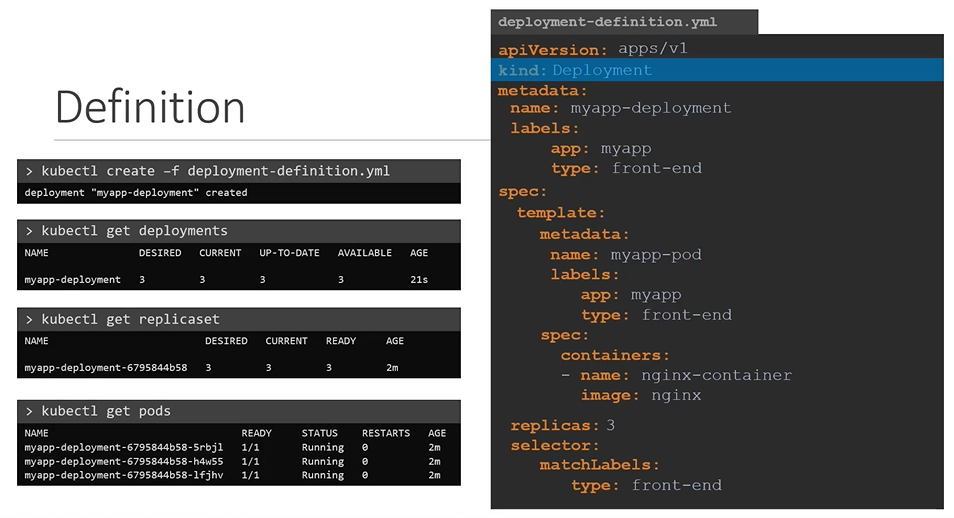

## DEPLOYMENT

In this section, we will take a look at kubernetes deployments

#### Deployment is a kubernetes object


#### How do we create deployment?

```
    apiVersion: apps/v1
    kind: Deployment
    metadata:
      name: myapp-deployment
      labels:
        app: myapp
        type: front-end
    spec:
     template:
        metadata:
          name: myapp-pod
          labels:
            app: myapp
            type: front-end
        spec:
         containers:
         - name: nginx-container
           image: nginx
     replicas: 3
     selector:
       matchLabels:
        type: front-end
 ```
- Once the file is ready, create the deployment using deployment definition file
  ```
  $ kubectl create -f deployment-definition.yaml
  ```
- To see the created deployment
  ```
  $ kubectl get deployment
  ```
- The deployment automatically creates a **`ReplicaSet`**. To see the replicasets
  ```
  $ kubectl get replicaset
  ```
- The replicasets ultimately creates **`PODs`**. To see the PODs
  ```
  $ kubectl get pods
  ```

  

- To see the all objects at once
  ```
  $ kubectl get all
  ```
  