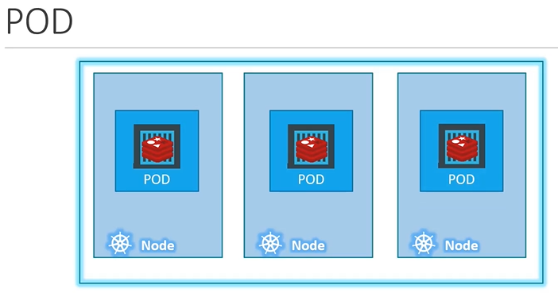
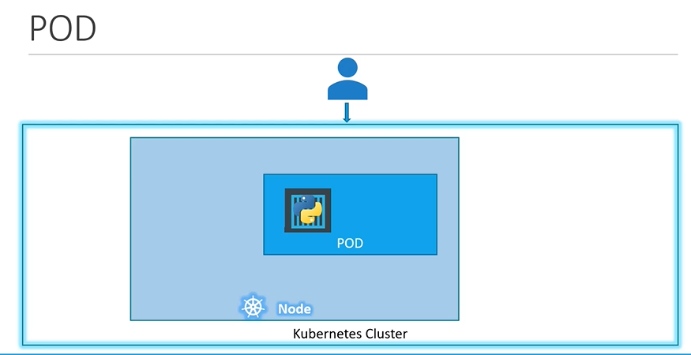
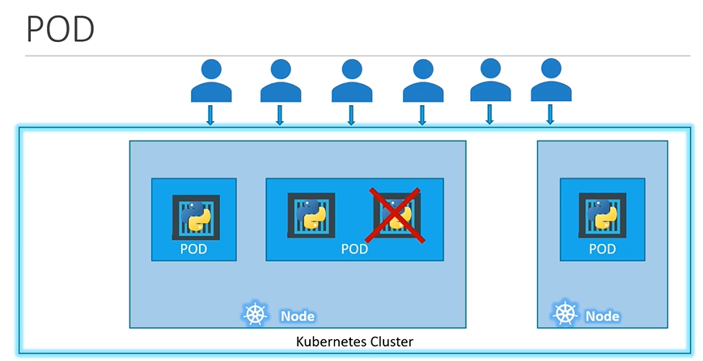
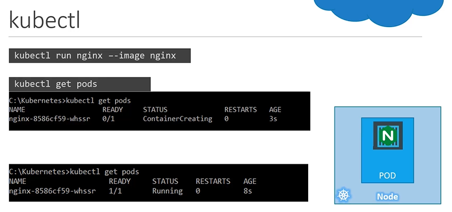

## PODS

In this section, we will take a look at PODS.
  - POD introduction
  - How to deploy pod?

#### Kubernetes doesn't deploy containers directly on the worker node



#### Here is a single node kubernetes cluster with single instance of your application running in a single docker container encapsulated in the pod



#### Pod will have a one-to-one relationship with containers running your application



## Multi-Container PODs
- A single pod can have multiple containers except for the fact that they are usually not multiple containers of the **`same kind`**


## Docker Example (Docker Link)


## How to deploy pods?
Lets now take a look to create a nginx pod using **`kubectl`**
- To deploy a docker container by creating a POD.
  ```
  $ kubectl run nginx --image nginx
  ```

- To get the list of pods
  ```
  $ kubectl get pods
  ```

   