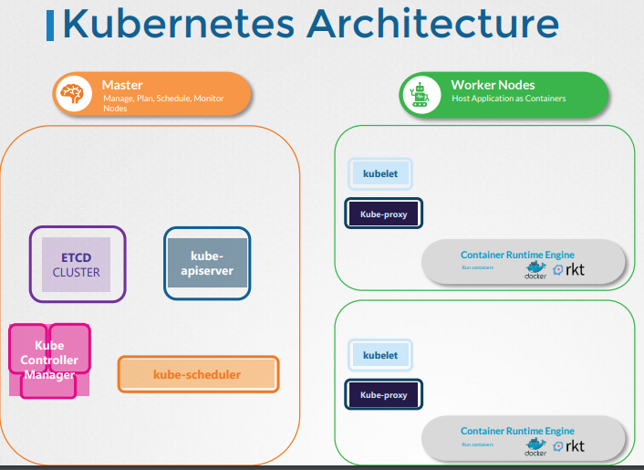

##   KUBERNETES ARCHITECTURE

- Kubernetes components include one or more master node and multiple worker nodes
- Master node has following components:
   - ETCD
   - kube-apiserver
   - Kube Controller Manager
   - kube-scheduler

- Worker nodes have following components:
   - Kubelet
   - Kube-proxy

  