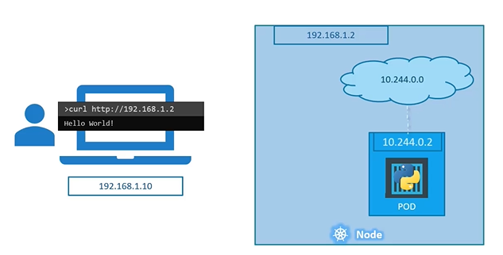
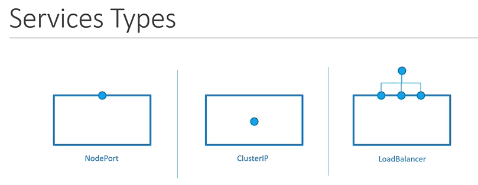
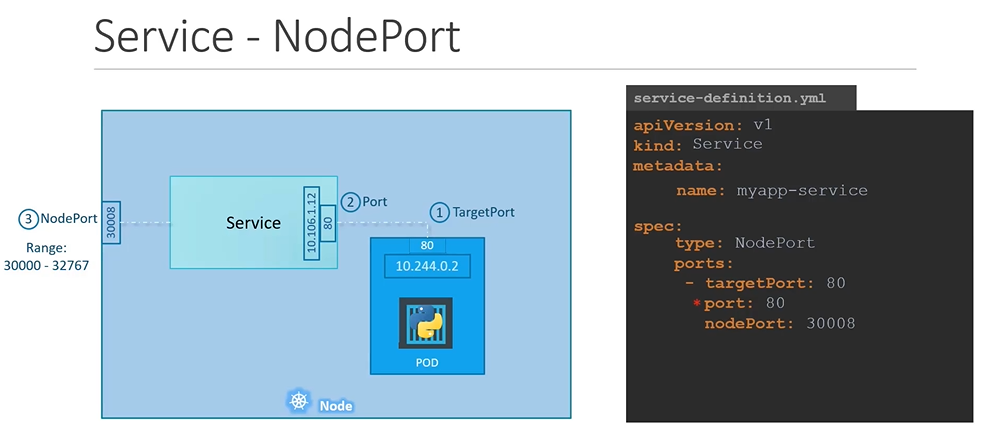
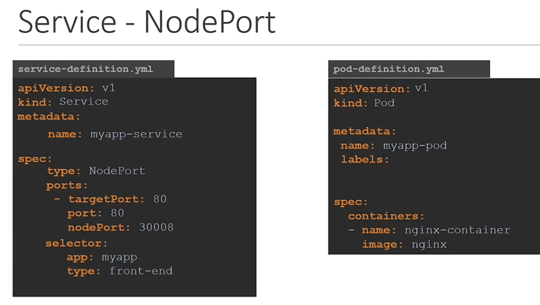
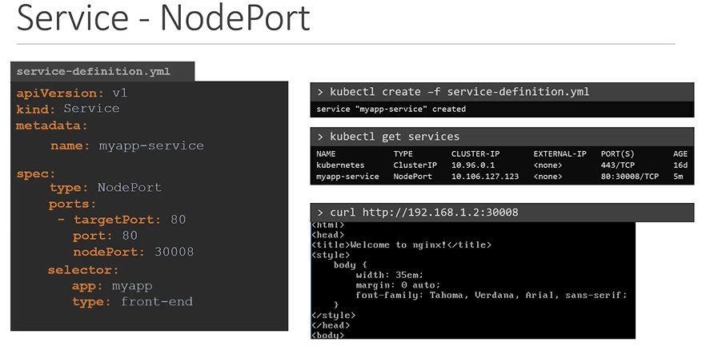

## SERVICES

- Kubernetes Services enables communication between various components within and outside of the application


#### Let's look at some other aspects of networking

## External Communication

- How do we as an **`external user`** access the **`web page`**?

  - From the node (Able to reach the application as expected)
  

  - From outside world (This should be our expectation, without something in the middle it will not reach the application)
  

 ## Service Types
 
 #### There are 3 types of service types in kubernetes
 

 1. NodePort
    - Where the service makes an internal port accessible on a port on the NODE.
      ```
      apiVersion: v1
      kind: Service
      metadata:
       name: myapp-service
      spec:
       types: NodePort
       ports:
       - targetPort: 80
         port: 80
         nodePort: 30008
      ```
      

      #### To connect the service to the pod
      ```
      apiVersion: v1
      kind: Service
      metadata:
       name: myapp-service
      spec:
       type: NodePort
       ports:
       - targetPort: 80
         port: 80
         nodePort: 30008
       selector:
         app: myapp
         type: front-end
       ```

       

       #### To create the service
      ```
      $ kubectl create -f service-definition.yaml
      ```
      
      #### To list the services
      ```
      $ kubectl get services
      ```
      
      #### To access the application from CLI instead of web browser
      ```
      $ curl http://192.168.1.2:30008
      ```

      

      #### A service with multiple pods

      

      #### When Pods are distributed across multiple nodes

      

2. ClusterIP
    - In this case the service creates a **`Virtual IP`** inside the cluster to enable communication between different services such as a set of frontend servers to a set of backend servers
    
3. LoadBalancer
    - Where the service provisions a **`loadbalancer`** for our application in supported cloud providers