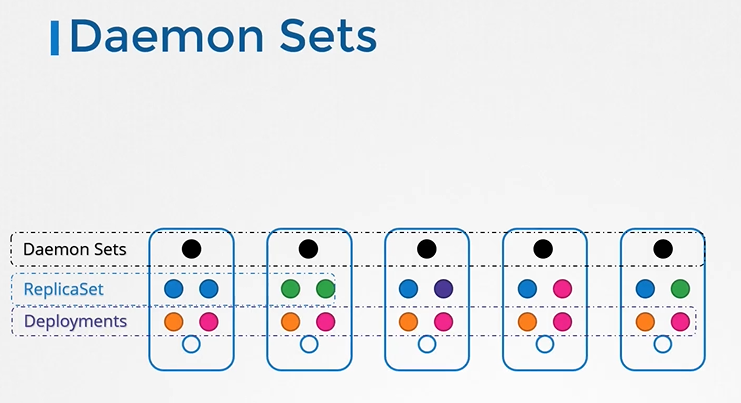
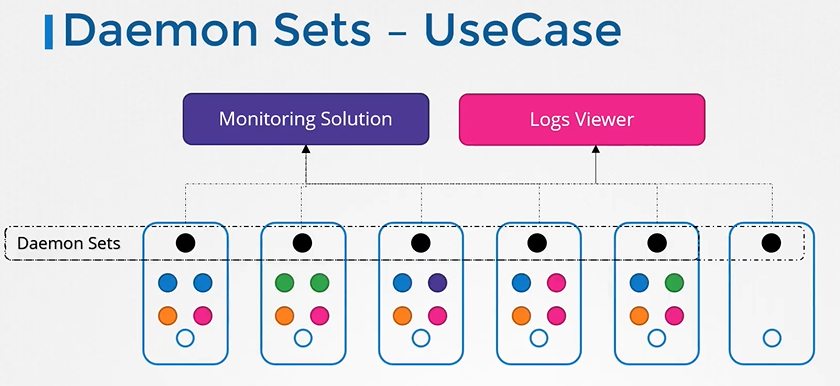
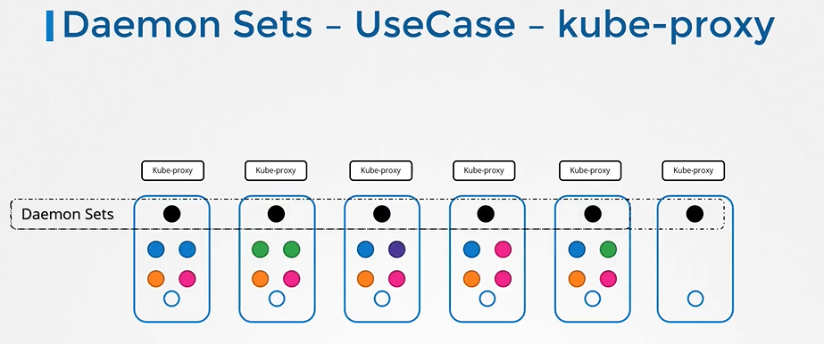
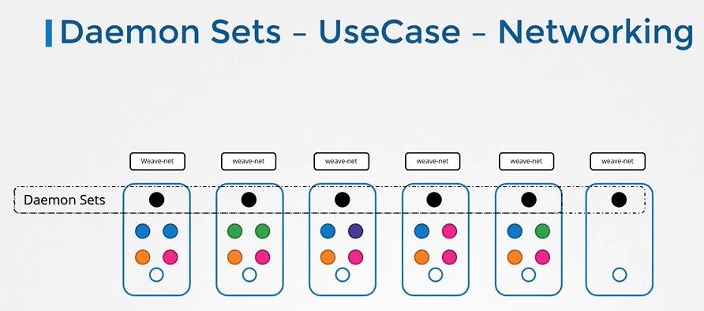
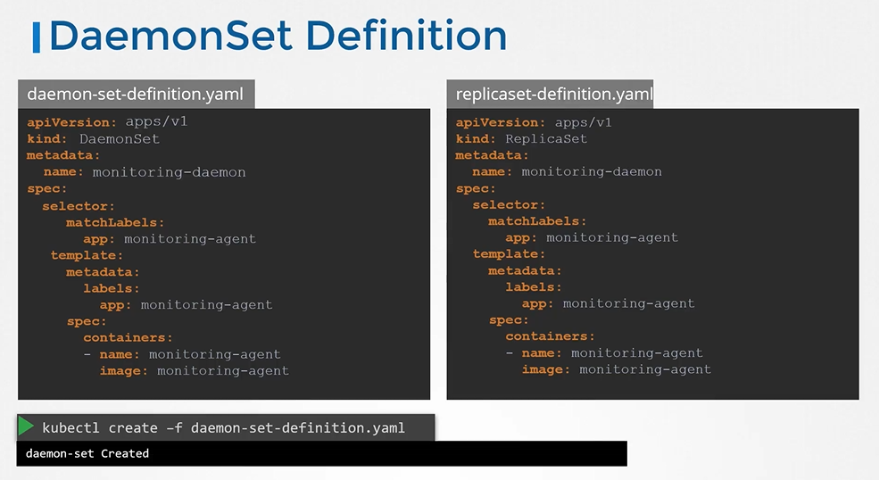
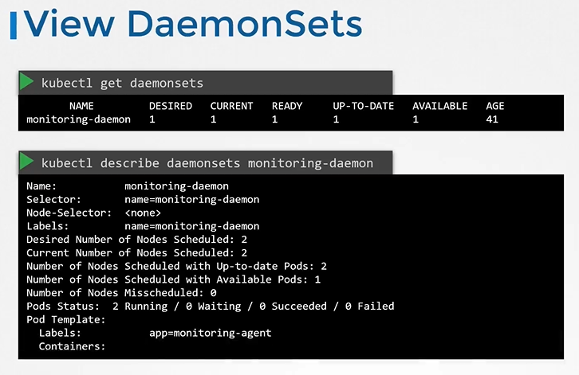
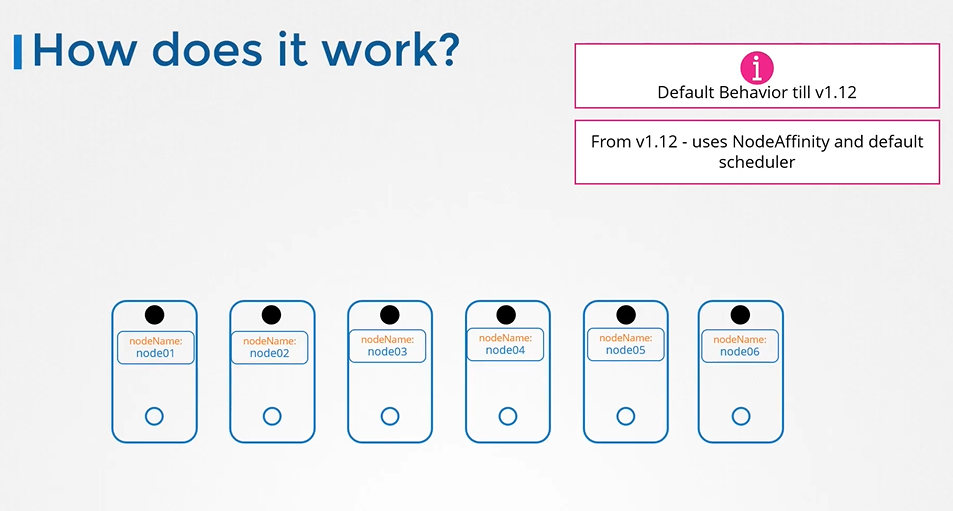

## DaemonSets

#### DaemonSets are like replicasets, as it helps in to deploy multiple instances of pod. But it runs one copy of your pod on each node in your cluster.
  
  
  
## DaemonSets - UseCases

  
  
  
  
  
  
## DaemonSets - Definition
- Creating a DaemonSet is similar to the ReplicaSet creation process.
- For DaemonSets, we start with apiVersion, kind as **`DaemonSets`** instead of **`ReplicaSet`**, metadata and spec. 
  ```
  apiVersion: apps/v1
  kind: Replicaset
  metadata:
    name: monitoring-daemon
    labels:
      app: nginx
  spec:
    selector:
      matchLabels:
        app: monitoring-agent
    template:
      metadata:
       labels:
         app: monitoring-agent
      spec:
        containers:
        - name: monitoring-agent
          image: monitoring-agent
  ```
  
  ```
  apiVersion: apps/v1
  kind: DaemonSet
  metadata:
    name: monitoring-daemon
    labels:
      app: nginx
  spec:
    selector:
      matchLabels:
        app: monitoring-agent
    template:
      metadata:
       labels:
         app: monitoring-agent
      spec:
        containers:
        - name: monitoring-agent
          image: monitoring-agent
  ```
  
  
- To create a daemonset from a definition file
  ```
  $ kubectl create -f daemon-set-definition.yaml
  ```

## View DaemonSets
- To list daemonsets
  ```
  $ kubectl get daemonsets
  ```
- For more details of the daemonsets
  ```
  $ kubectl describe daemonsets monitoring-daemon
  ```
  
  
## How DaemonSets Works

  

#### K8s Reference Docs
- https://kubernetes.io/docs/concepts/workloads/controllers/daemonset/#writing-a-daemonset-spec
