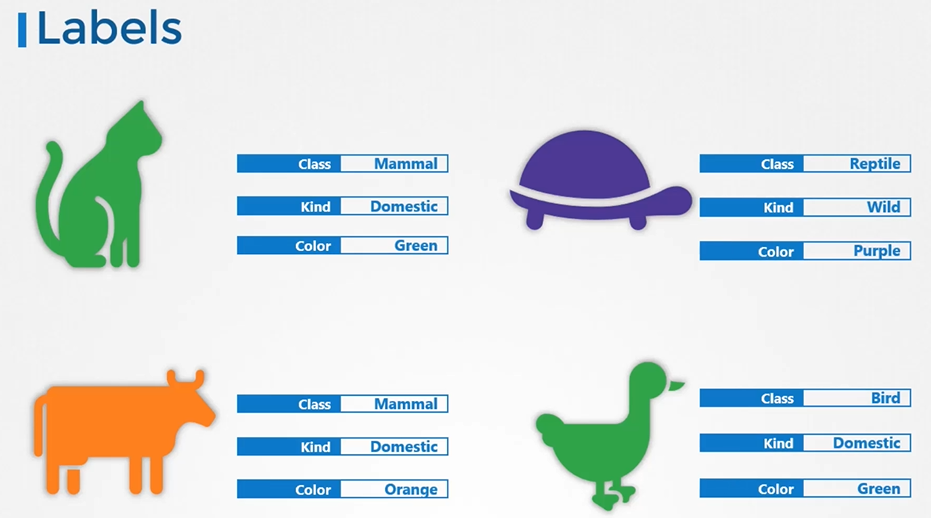
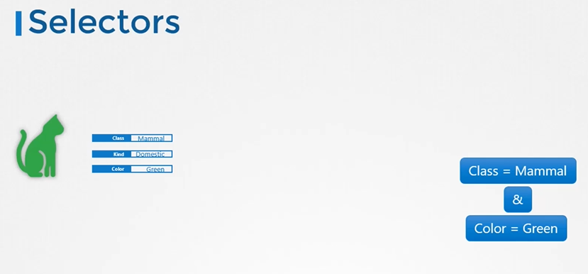
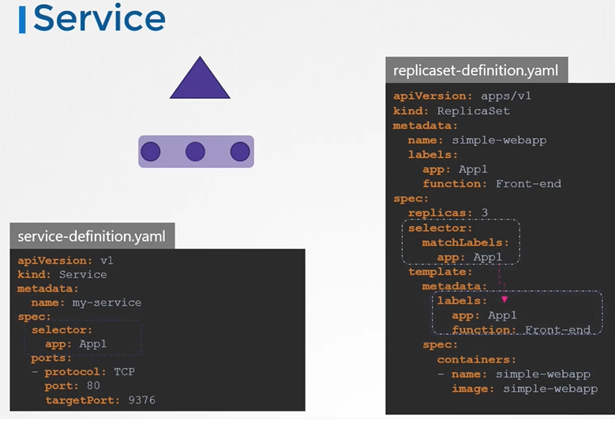

## Labels and Selectors
  
#### Labels and Selectors are standard methods to group things together.
  
#### Labels are properties attached to each item.

   
  
#### Selectors help you to filter these items
 
  
  
How are labels and selectors are used in kubernetes?
- We have created different types of objects in kubernetes such as **`PODs`**, **`ReplicaSets`**, **`Deployments`** etc.
  
  
  
How do you specify labels?
   ```
    apiVersion: v1
    kind: Pod
    metadata:
     name: simple-webapp
     labels:
       app: App1
       function: Front-end
    spec:
     containers:
     - name: simple-webapp
       image: simple-webapp
       ports:
       - containerPort: 8080
   ```
 
 
Once the pod is created, to select the pod with labels run the below command
```
$ kubectl get pods --selector app=App1
```

Kubernetes uses labels to connect different objects together
   ```
    apiVersion: apps/v1
    kind: ReplicaSet
    metadata:
      name: simple-webapp
      labels:
        app: App1
        function: Front-end
    spec:
     replicas: 3
     selector:
       matchLabels:
        app: App1
     template:
       metadata:
         labels:
           app: App1
           function: Front-end
       spec:
         containers:
         - name: simple-webapp
           image: simple-webapp   
   ```

  

For services
 
      ```
      apiVersion: v1
      kind: Service
      metadata:
       name: my-service
      spec:
       selector:
         app: App1
       ports:
       - protocol: TCP
         port: 80
         targetPort: 9376 
       ```
  
  
## Annotations
- While labels and selectors are used to group objects, annotations are used to record other details for informative purpose.
    ```
    apiVersion: apps/v1
    kind: ReplicaSet
    metadata:
      name: simple-webapp
      labels:
        app: App1
        function: Front-end
      annotations:
         buildversion: 1.34
    spec:
     replicas: 3
     selector:
       matchLabels:
        app: App1
    template:
      metadata:
        labels:
          app: App1
          function: Front-end
      spec:
        containers:
        - name: simple-webapp
          image: simple-webapp   
    ```

K8s Reference Docs:
- https://kubernetes.io/docs/concepts/overview/working-with-objects/labels/
