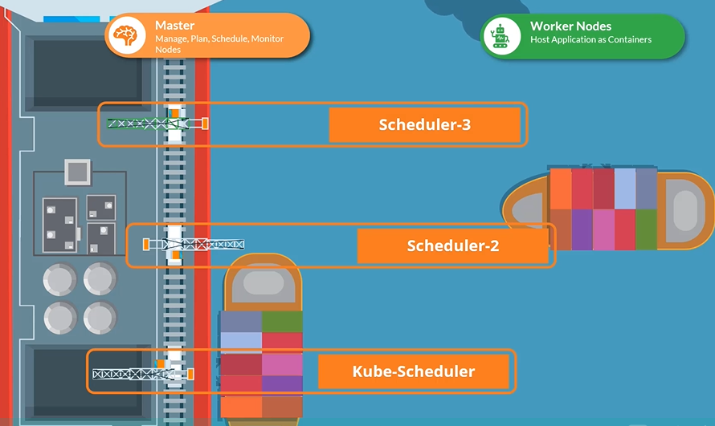
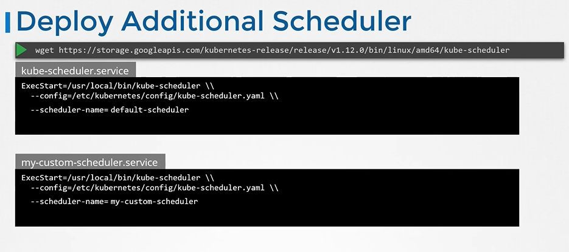
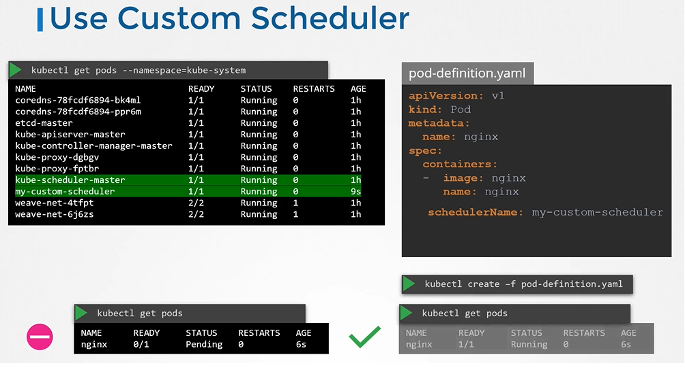
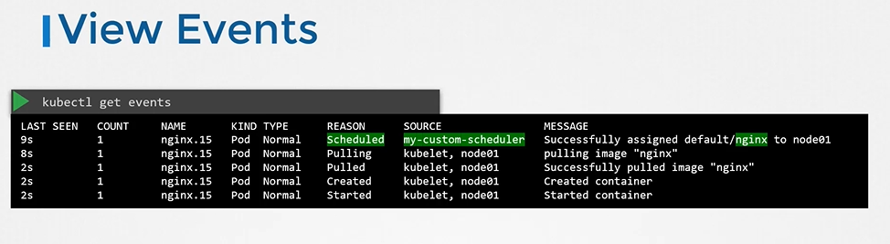
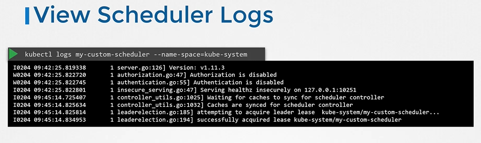

## Multiple Schedulers 

## Custom Schedulers
- Your kubernetes cluster can schedule multiple schedulers at the same time.

  
  
## Deploy additional scheduler
- Download the binary
  ```
  $ wget https://storage.googleapis.com/kubernetes-release/release/v1.12.0/bin/linux/amd64/kube-scheduler
  ```
  
  
## Deploy additional scheduler - kubeadm
   
  
  
  - To create a scheduler pod
    ```
    $ kubectl create -f my-custom-scheduler.yaml
    ```
  
## View Schedulers
- To list the scheduler pods
  ```
  $ kubectl get pods -n kube-system
  ```

## Use the Custom Scheduler
- Create a pod definition file and add new section called **`schedulerName`** and specify the name of the new scheduler
  ```
  apiVersion: v1
  kind: Pod
  metadata:
    name: nginx
  spec:
    containers:
    - image: nginx
      name: nginx
    schedulerName: my-custom-scheduler
  ```
  
  
- To create a pod definition
  ```
  $ kubectl create -f pod-definition.yaml
  ```
- To list pods
  ```
  $ kubectl get pods
  ```

## View Events
- To view events
  ```
  $ kubectl get events
  ```
  
  
## View Scheduler Logs
- To view scheduler logs
  ```
  $ kubectl logs my-custom-scheduler -n kube-system
  ```
  
  
#### K8s Reference Docs
- https://kubernetes.io/docs/tasks/extend-kubernetes/configure-multiple-schedulers/
