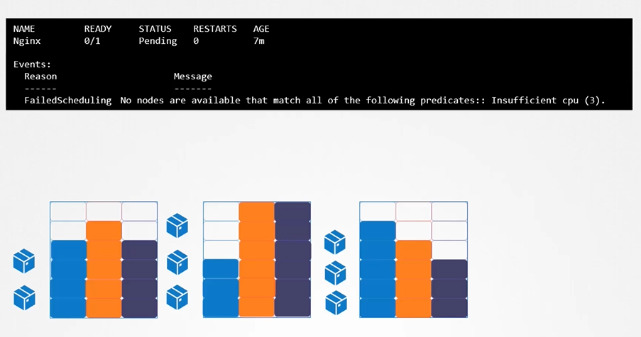
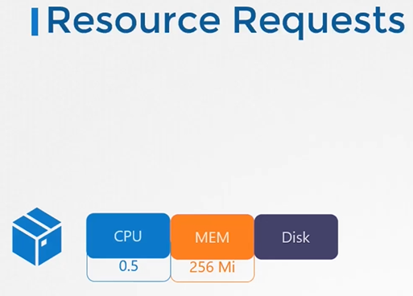
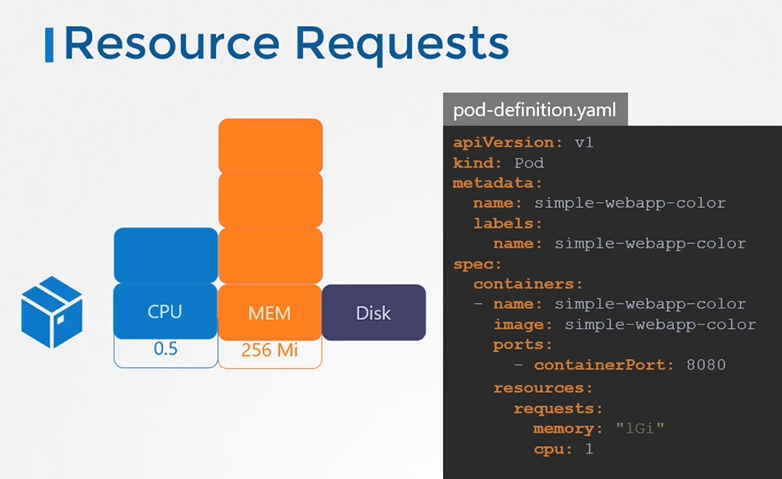
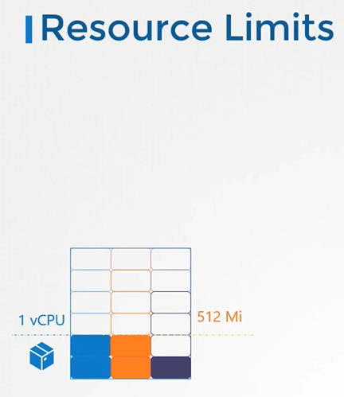
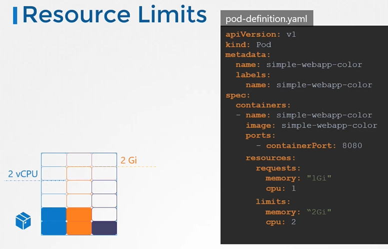
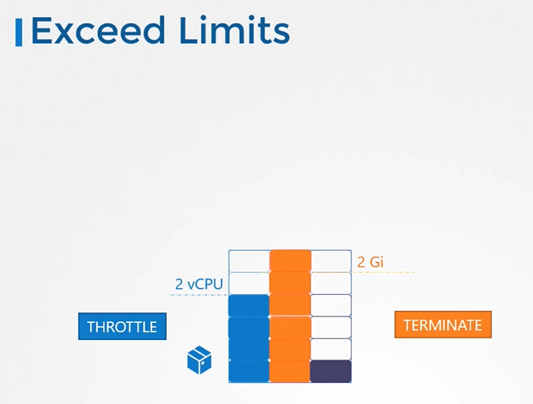

## Resource Limits

#### Let us take a look at 3 node kubernetes cluster.
- Each node has a set of CPU, Memory and Disk resources available.
- If there is no sufficient resources available on any of the nodes, kubernetes holds the scheduling the pod. You will see the pod in pending state. If you look at the events, you will see the reason as insufficient CPU.
  
  
  
## Resource Requirements
- By default, K8s assume that a pod or container within a pod requires **`0.5`** CPU and **`256Mi`** of memory. This is known as the **`Resource Request` for a container**.
  
  
  
- If your application within the pod requires more than the default resources, you need to set them in the pod definition file.

  ```
  apiVersion: v1
  kind: Pod
  metadata:
    name: simple-webapp-color
    labels:
      name: simple-webapp-color
  spec:
   containers:
   - name: simple-webapp-color
     image: simple-webapp-color
     ports:
      - containerPort:  8080
     resources:
       requests:
        memory: "1Gi"
        cpu: "1"
  ```
  
   
## Resources - Limits
- By default, k8s sets resource limits to 1 CPU and 512Mi of memory
  
  
  
- You can set the resource limits in the pod definition file.
  
  ```
  apiVersion: v1
  kind: Pod
  metadata:
    name: simple-webapp-color
    labels:
      name: simple-webapp-color
  spec:
   containers:
   - name: simple-webapp-color
     image: simple-webapp-color
     ports:
      - containerPort:  8080
     resources:
       requests:
        memory: "1Gi"
        cpu: "1"
       limits:
         memory: "2Gi"
         cpu: "2"
  ```
  
  
#### Note: Remember Requests and Limits for resources are set per container in the pod.
  
## Exceed Limits
- what happens when a pod tries to exceed resources beyond its limits?

   
   
  
#### K8s Reference Docs:
- https://kubernetes.io/docs/concepts/configuration/manage-resources-containers/