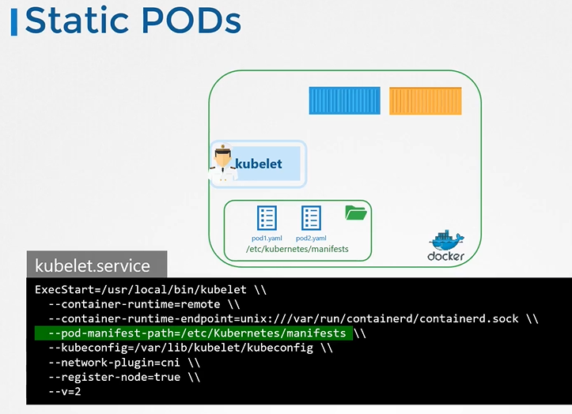
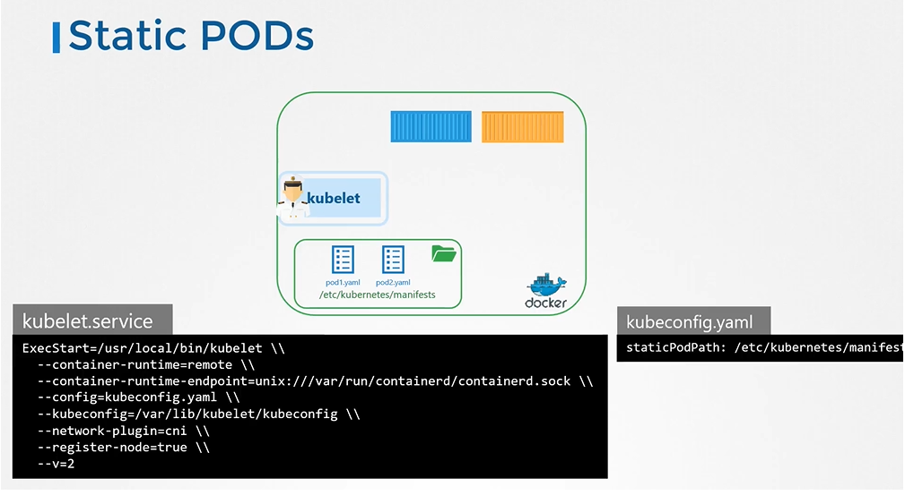
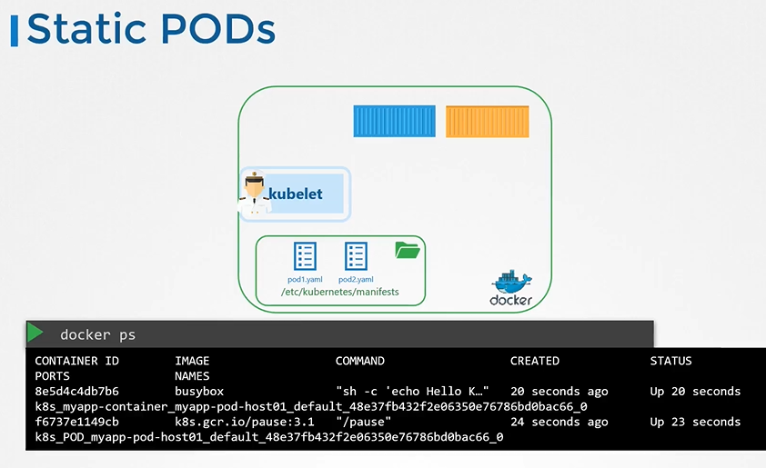
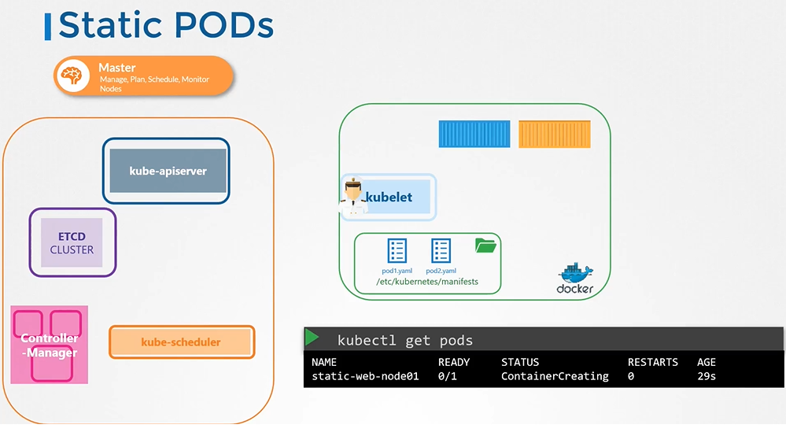
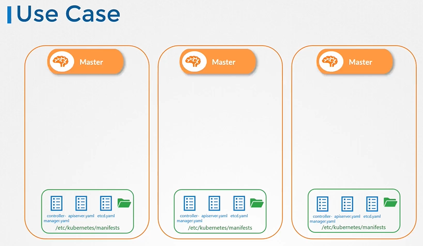
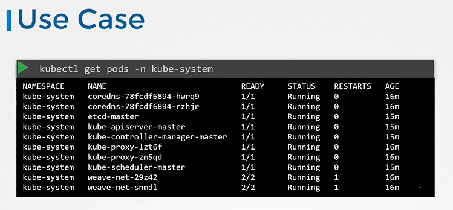
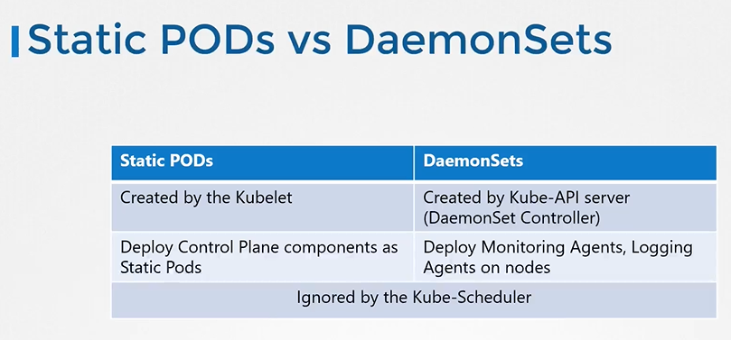

## Static Pods

#### How do you provide a pod definition file to the kubelet without a kube-apiserver?
- You can configure the kubelet to read the pod definition files from a directory on the server designated to store information about pods.

## Configure Static Pod
- The designated directory can be any directory on the host and the location of that directory is passed in to the kubelet as an option while running the service.
  - The option is named as **`--pod-manifest-path`**.
  
  
  
## Another way to configure static pod 
- Instead of specifying the option directly in the **`kubelet.service`** file, you could provide a path to another config file using the config option, and define the directory path as staticPodPath in the file

- Run the command `ps -aux | grep kubelet` and identify the config file - `--config=/var/lib/kubelet/config.yaml`. Then checkin the config file for staticPdPath

  

## View the static pods
- To view the static pods
  ```
  $ docker ps
  ```
  

#### The kubelet can create both kinds of pods - the static pods and the ones from the api server at the same time.

  

## Static Pods - Use Case

  
  
  
  
## Static Pods vs DaemonSets

   
  

#### K8s Reference Docs
- https://kubernetes.io/docs/tasks/configure-pod-container/static-pod/
