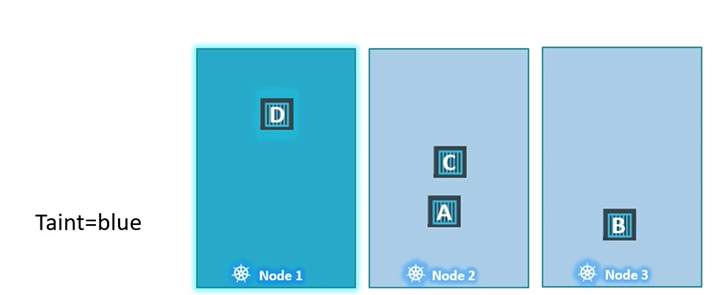
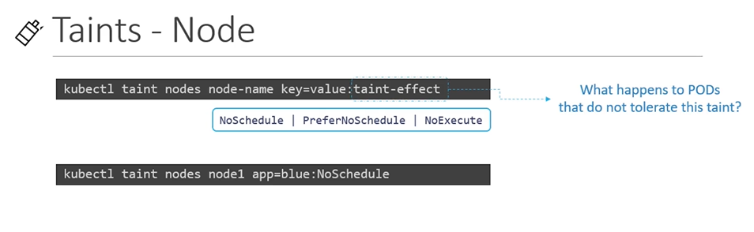
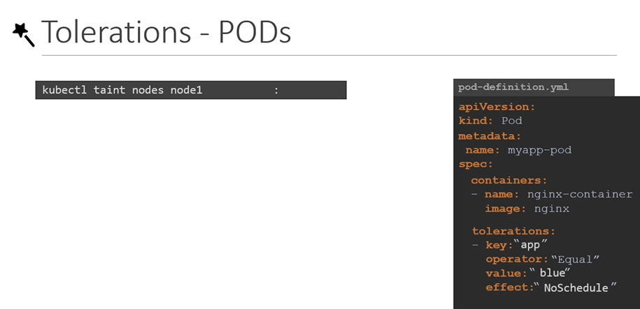
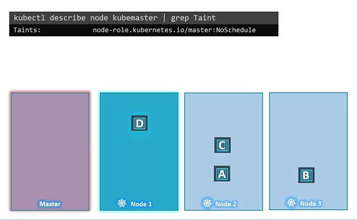

# Taints and Tolerations

- Pod to node relationship and how you can restrict what pods are placed on what nodes.

#### Taints and Tolerations are used to set restrictions on what pods can be scheduled on a node. 
- Only pods which are tolerant to the particular taint on a node will get scheduled on that node.

  
  
## Taints
- Use **`kubectl taint nodes`** command to taint a node.

  Syntax
  ```
  $ kubectl taint nodes <node-name> key=value:taint-effect
  ```
 
  Example
  ```
  $ kubectl taint nodes node1 app=blue:NoSchedule
  ```
  
- The taint effect defines what would happen to the pods if they do not tolerate the taint.
- There are 3 taint effects
  - **`NoSchedule`**
  - **`PreferNoSchedule`**
  - **`NoExecute`**
  
  
  
## Tolerations
   - Tolerations are added to pods by adding a **`tolerations`** section in pod definition.
     ```
     apiVersion: v1
     kind: Pod
     metadata:
      name: myapp-pod
     spec:
      containers:
      - name: nginx-container
        image: nginx
      tolerations:
      - key: "app"
        operator: "Equal"
        value: "blue"
        effect: "NoSchedule"
     ```
    
    

    

#### Taints and Tolerations do not tell the pod to go to a particular node. Instead, they tell the node to only accept pods with certain tolerations.
- To see this taint, run the below command
  ```
  $ kubectl describe node kubemaster |grep Taint
  ```
 

  
     
#### K8s Reference Docs
- https://kubernetes.io/docs/concepts/scheduling-eviction/taint-and-toleration/

