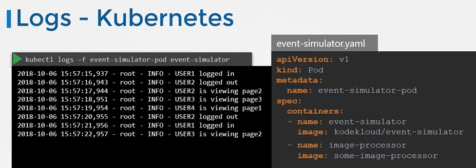

### Logs - Kubernetes
```
apiVersion: v1
kind: Pod
metadata:
  name: event-simulator-pod
spec:
  containers:
  - name: event-simulator
    image: kodekloud/event-simulator
```
## Managing Application Logs

- To view the logs
  ```
  $ kubectl logs -f event-simulator-pod
  ```
- If there are multiple containers in a pod then you must specify the name of the container explicitly in the command.
  ```
  $ kubectl logs -f <pod-name> <container-name>
  $ kubectl logs -f even-simulator-pod event-simulator
  ```

  

#### K8s Reference Docs
- https://kubernetes.io/blog/2015/06/cluster-level-logging-with-kubernetes/