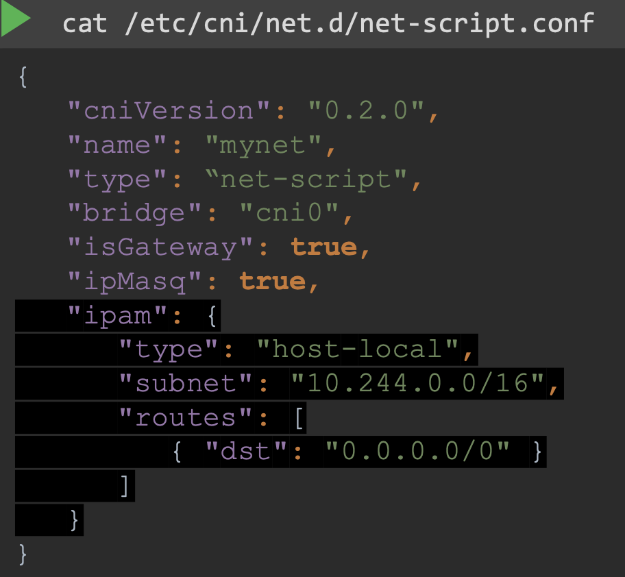

## CNI IN KUBERNETES

1. The CNI plugin is configured on the kubelet service on each node in the cluster
      
    kubelet.service
         
        ...
        --network-plugin=cni \\
        --cni-bin-dir=<directory-location> \\ # usually /opt/cni/bin
        --cni-conf-dir=<directory-location> \\ # usually /etc/cni/net.d
        ...

    - Can also see kubelet options
          
          $ ps -aux | grep kubelet

    - `cni-bin-dir` has all the supported cni plugins as executables
    - `cni-config-dir` has a set of configuration files. This is where the kubelet looks to find out which plugin is to be used. If it has multiple files, it will choose the file in alphabetical order

   ## CNI WEAVE

   - One of the networking solutions that can be used by Kubernetes is Weaveworks
   - Weave CNI plugin deploys an agent or service on each node in the cluster
   - These agents communicate with each other to exchange information about nodes, networks, and pods within them
   - Each agent stores a topology of the entire setup. That's how they know the pods and their IPs on the other nodes
   - Weave creates its own bridge and names it Weave and assigns an IP address to each network

        ### DEPLOYING WEAVE ON KUBERNETES CLUSTER
     - Weave and weave peers can be deployed as `services` or `daemons` on each node in the cluster manually
     - If the kubernetes is set up manually, then easier way to do that is to deploy it as pods in the cluster. The weave peers are deployed as a `daemonset` (daemonset ensures that one pod of the given kind is deployed on each node in the cluster)
     - For troubleshooting, view logs
         
           $ kubectl logs <weave-pod-name> weave -n kube-system
        
     ### IP ADDRESS MANAGEMENT

     - Weave manages IP address assignments to the virtual network and pods through its plugins
     - We can configure details which plugin to use for IP management inside the configuration file:

       

