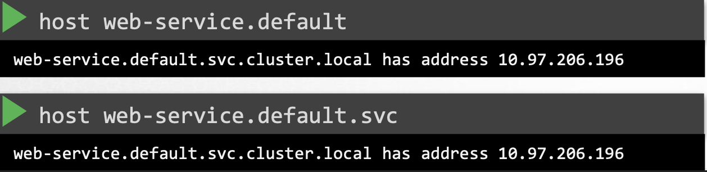
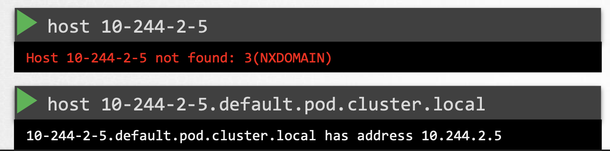

## COREDNS

- It is a recommended way to implement DNS in Kubernetes
- It is deployed as a deployment
- It uses Corefile to get necessary configurations to configure DNS server. The location of the corefile is `/etc/coredns/Corefile`
    - It has number of plugins configured
    - The plugin that makes coredns work with Kubernetes is `kubernetes`. This is where the top-level domain name of the cluster is set. So every record in coredns DNS server falls under this domain. This is where `pods` field can be added to enable coredns to manage dns for pods  
    - This corefile is passed in as a `configmap` to the pods

- Kubelet is responsible to configure pods to use coredns as dns server (configs in `/etc/resolv.conf`). We can check this configuration via kubelet from `/var/lib/kubelet/config.yaml` file under `clusterDNS` and `clusterDomain` fields

- To check IPs from records:
       
    1. For services: 

           $ host [<service-name> | <service-fqdn>]
        
 
       You can use either of the names to get its IP address because of below entries:
       
       

    2. For pods: We will always have to use its FQDN as it does not have any entry in `/etc/resolv.conf`
       
       

        
