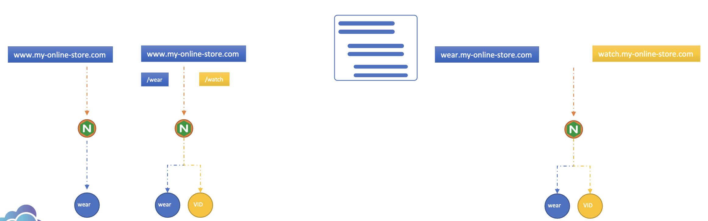
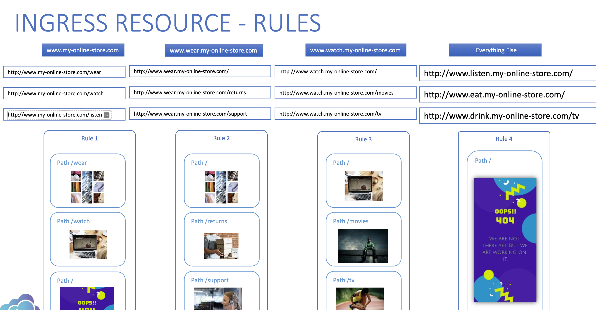

## INGRESS

- Helps users access your application using a single externally accessible URL that you can configure throughout the different services within your cluster based on the URL path
- It also implements SSL security
- It still needs to be exposed so we will need to create a NodePort service for that but all the load balancing, authentication, SSL, and URL based routing configuration are made on ingress controller
- This is how Kubernetes implements Ingress. The `Ingress Controller is NOT deployed by default` and Ingress Resources are similar to other Kubernetes resources (yaml files)

  

  ## INGRESS CONTROLLER (NGINX for example)
  - They are not just another load balancer or nginx server
  - Load balancer components are just a part of it. They have additional intelligence built into them to monitor the kubernetes cluster for new definitions or ingress resources and configure the nginx server accordingly
  - An nginx controller is deployed just as another deployment in K8s
  - With the deployment of nginx ingress image, `a service to expose it, a configmap to feed nginx configuration data, and a service account with right permissions` to access all these objects, we should be ready with an ingress controller in its simplest form

  ## INGRESS RESOURCES
  - A set of rules and configurations applied on the ingress controllers
  - You can set rules like send all traffic to one single application or route traffic to different applications based on the URL OR route users based on the domain name itself

    
  - You can have rules at top for each host or domain name and within each rule, you have different paths to route traffic based on the URL
     

  - Create ingress resource an imperative way
   
          $ kubectl create ingress <ingress-name> --rule="host/path=service:port"

          Example: $ kubectl create ingress ingress-test --rule="wear.my-online-store.com/wear*=wear-service:80"

  - Go through nginx rewrite-target option here: https://kubernetes.github.io/ingress-nginx/examples/rewrite/

  - See other options here: https://kubernetes.github.io/ingress-nginx/examples/

 
