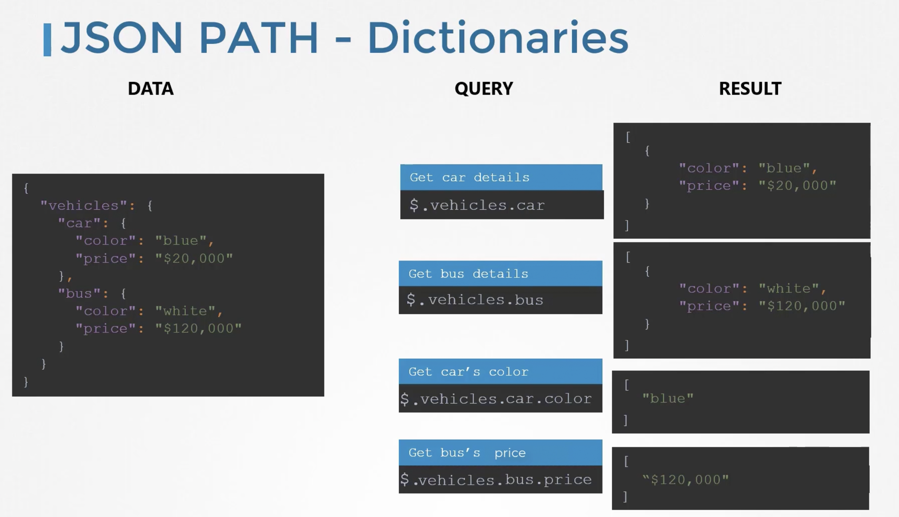
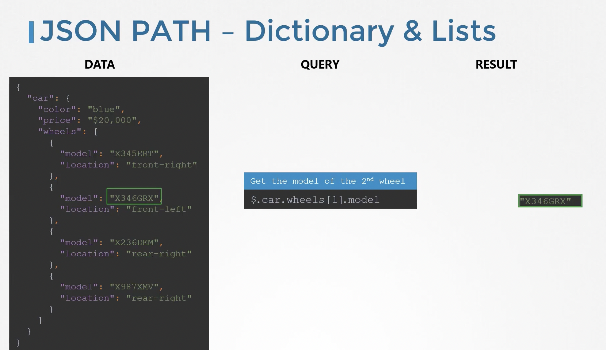
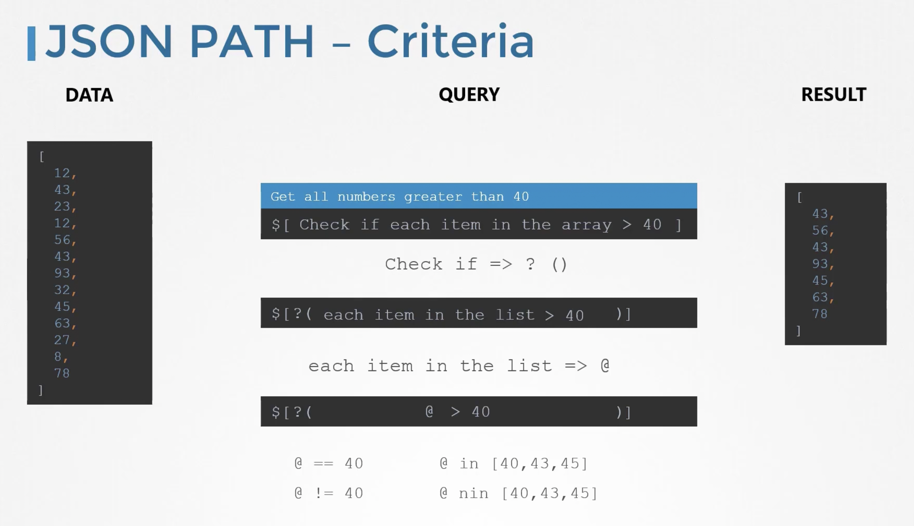

## {} BASICS OF JSONPATH

- You use $ for root element for dictionaries only:

   

-  Dealing with list of dictionaries:

   

- Conditions in JSONPATH:

   

Refer to this documentation for more information: https://kubernetes.io/docs/reference/kubectl/jsonpath/