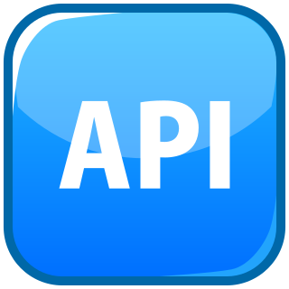

##  API Groups

1. Check the version of the cluster, hit the api - `version` (port by default is `6443`)
   
        $ curl https://kube-master:6443/version

2. To get the list of pods, hit the api - `/api/v1/pods`

        $ curl https://kube-master:6443/api/v1/pods

3. We have following apis:

     - `/metrics` - To monitor the health of the system
     - `/healthz` - To monitor the health of the system
     - `/logs` - Responsible for integrating with 3rd party logging applications

4. 2 APIs responsible for the cluster functionality are:

    - `/api` -  core group (where all core functionalities exist)
    - `/apis` - named group (are more organized)

   Refer this for more info: https://github.com/kodekloudhub/certified-kubernetes-administrator-course/blob/master/docs/07-Security/15-API-Groups.md#api-and-apis

5. View available APIs on your Kubernetes cluster:

    - Access kube-apiserver at port `6443` without any path and it will list the available API groups

          $ curl http://localhost:6443 -k

    - Within the named API groups, it returns all supported resource groups

          $ curl http://localhost:6443/apis -k | grep "name"

    NOTE: Above commands will require you to pass on the certificate files to authenticate the request. Alternative way is given below

6. To list all available APIs at root locally:

     - Run below command to run a proxy service locally at port `8001` and uses credentials and certificates from your kubeconfig file to access the cluster
        
           $ kubectl proxy

    - Run below curl command to get the list of APIs available at root
        
           $ curl http://localhost:8001 -k

## NOTE:
1. kube proxy != kubectl proxy
   
       kube proxy: Used to enable connectivity between pods and services across various nodes in the cluster

       kubectl proxy: An HTTP proxy service created by kubectl utility to access the kube-apiserver  